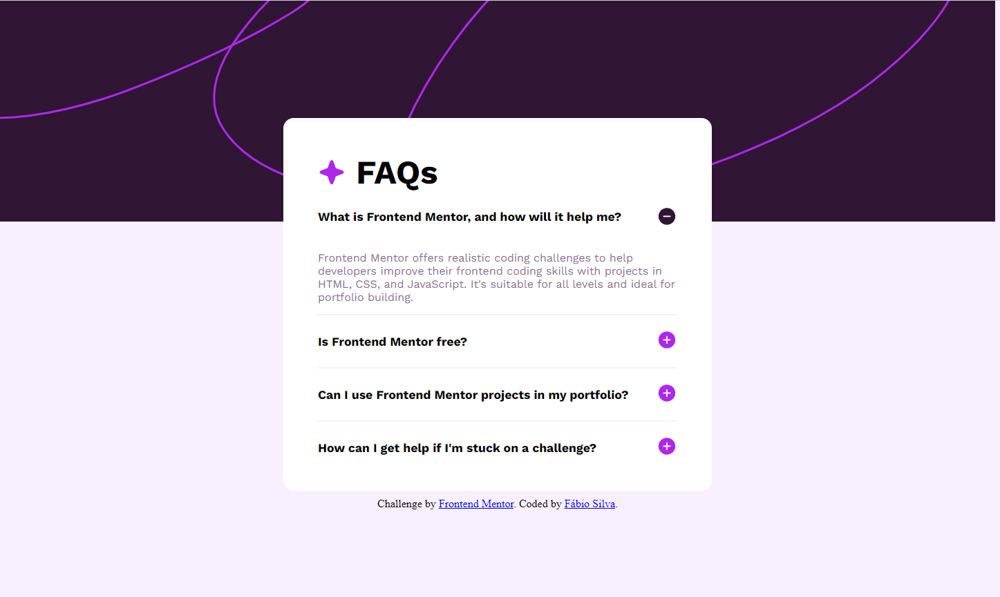

# Social Links Profile
---

## Project Description
I made this project in order to improve my HTML, CSS and JS.
I used the site [Frontend Mentor](https://www.frontendmentor.io/challenges/recipe-page-KiTsR8QQKm) and choose the challenge "FAQ accordation".

I had to replicate the layout of the original.

This is a simple page that shows a FAQ, the answer starts hidden and when the users click on the question or on the icon( + / - ) the answer will show up or close.

I felt dificulty ending this project mainly in the javaScript, this was my first time building some interactivity into the page i had to search how to do it. In the end i manage to understand make it work i am proud of it but at the same time i lack more practice.
I also had problems with the layaout due to the answers being interactive, my card was shifting upwards when answer was open, in the end this was solved, the card no longer shifts upwards.
My replica is super similar to the original and it responds well to small devices.

---
## Technologies used

I used HTML, CSS and JS to finish this challenge.

---
## Preview

